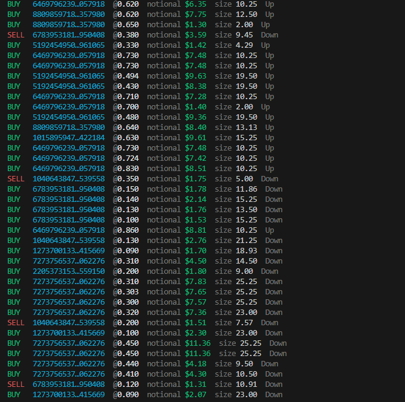
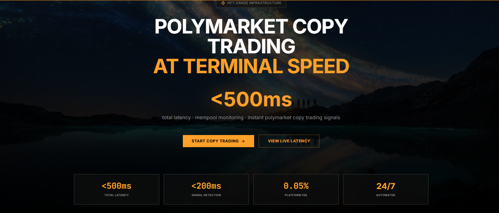
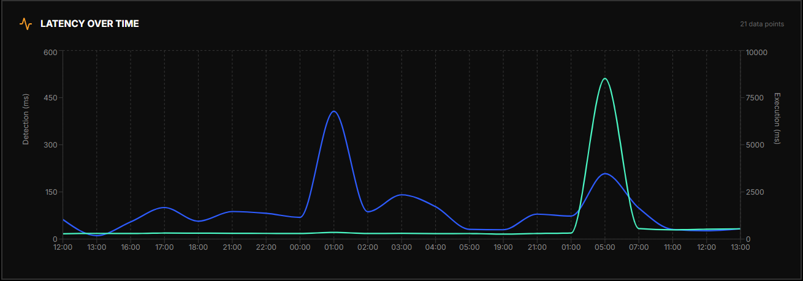

# Polymarket Sports & Crypto Copy Trading Bot

[](https://github.com/polymarket-trading-bot-venture-team/polymarket-copy-trading-bot)
[](https://github.com/polymarket-trading-bot-venture-team/polymarket-copy-trading-bot/stargazers)

**Repository:** [github.com/polymarket-trading-bot-venture-team/polymarket-copy-trading-bot](https://github.com/polymarket-trading-bot-venture-team/polymarket-copy-trading-bot) · **Organization:** [Polymarket Venture Team — London](https://github.com/polymarket-trading-bot-venture-team)

---

**Polymarket copy trading bot** for **sports**, **crypto** (e.g. BTC/ETH/SOL 15‑minute and other event markets), and **any** prediction market on Polymarket that has a CLOB—**politics, macro, props**, same stack. Mirror **top traders**’ fills onto **your** wallet with proportional sizing, spend limits, and optional **mempool** acceleration.

Built in **TypeScript** (Node.js): **Data API** trade detection (`/trades`), optional **Alchemy** mempool bursts, **FOK** orders via [`@polymarket/clob-client`](https://www.npmjs.com/package/@polymarket/clob-client).

> **Unofficial / community tool.** Not affiliated with Polymarket. Trading involves risk; this is not financial advice.

### Quick start

```bash
git clone https://github.com/polymarket-trading-bot-venture-team/polymarket-copy-trading-bot.git
cd polymarket-copy-trading-bot
cp .env.example .env
# Edit .env — never commit real keys (see Security)
npm install
```

Related: [Polymarket copy trading](https://polymarket.com/copy-trading) (product context).

### Screenshots

**1 — Live copy log (this bot)**  
Colored **BUY/SELL** stream: leader id, `@` price, notional, size, and outcome (**Up** / **Down** style binaries)—same information density as a “terminal speed” copy stack.



**2 — Target product experience (reference: [PolyCopy](https://www.polycopy.dev/))**  
Landing-style view: **&lt;500ms** total latency narrative, mempool monitoring, signal/ops metrics (**&lt;200ms** detection, fee, 24/7). This bot targets the same *class* of pipeline (API + optional mempool → CLOB); your measured latency depends on VPS, RPC, and market load.



**3 — Latency over time (reference dashboard)**  
Example chart: **detection** vs **execution** latency over time (detection usually sub‑150ms; execution mostly low with occasional network spikes). Useful mental model when tuning `POLL_INTERVAL_MS`, RPC, and region.



---

## PolyCopy-style pipeline (conceptual parity)

Commercial stacks such as **[PolyCopy](https://www.polycopy.dev/)** market *Polymarket copy trading at terminal speed*: mempool-aware signals, sub‑500 ms class latency targets, CLOB connectivity, and automated mirroring. **This repository implements the same logical pipeline in open source**—detection → proportional sizing → signed orders on the **official Polymarket CLOB**—so behavior matches that model end‑to‑end on your infrastructure (VPS + `.env`).

| Idea (as described on [polycopy.dev](https://www.polycopy.dev/)) | This bot |
|------------------------------------------------------------------|----------|
| Fast signal path (mempool + API) | ✅ Optional **mempool** burst + **Data API** poll (`/trades`) |
| Mirror leader fills on **your** wallet | ✅ `COPY_TRADERS` → same side / token → your `PRIVATE_KEY` + proxy |
| Low-latency execution | ✅ **FOK** market orders via `@polymarket/clob-client` |
| You hold keys | ✅ Self-custody; no hosted wallet required |

*Not affiliated with PolyCopy / AIEngine LTD. This is an independent TypeScript implementation; we do not distribute their proprietary software.*

### Sports vs crypto copy trading (same bot)

This **one** codebase copies **whatever markets your leader trades**—no separate “sports mode” vs “crypto mode” in config. You only set **`COPY_TRADERS`** (leader proxy wallets).

| | **Sports & events** | **Crypto & macro** |
|---|---------------------|----------------------|
| **Examples** | NFL, NBA, soccer, props, game totals | BTC/ETH/SOL/XRP **15‑minute** up/down, halving, Fed, elections |
| **How it shows up** | Data API returns fills with outcomes like team names, **Over/Under** | Same API: outcome labels like **Up/Down**, Yes/No |
| **Bot behavior** | Identical: same **side**, same **conditional token** (`assetId`), proportional **FOK** copy | Identical |

**Crypto 15‑min** products are high‑churn; **sports** may have longer‑lived books—both work as long as the market has an active CLOB. Use a **VPS** near your RPC for either workload.

**How it works (one sentence):** watch leader wallet(s) → on each new fill, recompute **your** size from strategy & caps → **FOK** order on the **same** outcome token → Polygon settlement.

## Architecture

```
Leader Wallet → Polygon/Mempool → Alchemy (early detection)
                    ↓
Polymarket API → Trades Poll (500ms) → VPS Bot
                    ↓
Pre-signed proportional order → CLOB API → Polygon settlement
```

### Detection (dual-path)

| Method | Latency | Use |
|--------|---------|-----|
| **Data API polling** | ~500ms | Primary: `GET /trades?user=LEADER` |
| **Alchemy mempool** | Pre-block | Optional: `alchemy_pendingTransactions` filtered by leader wallet |

When mempool sees a pending tx from the leader, the bot triggers an immediate API poll burst for faster confirmation.

### Execution

- **Proportional sizing**: 50–80% of leader stake (configurable)
- **FOK market orders**: Fill-or-kill for immediate execution
- **Slippage protection**: Worst-price limit via `max_slippage_bps`
- **Persistent HTTP/2**: Reduces handshake overhead

## Logs

Console output follows a **PolyCopy-style terminal**: fake window chrome (`●●●` + title), `$ copybot status` with teal **✓** lines (CLOB, mempool, leaders), then **`$ copybot watch 0x…`**. Each trade is a block:

1. **`[HH:MM:SS.mmm] Signal detected:`** — grey timestamp, green/red side, size, `@` price, outcome (and leader wallet).
2. **DRY RUN** — amber “mirror only” line, or **live:** **`Order placed in Nms`** (amber).
3. **`Fill confirmed:`** — teal (live only).

Set `NO_COLOR=1` to disable colors.

| Env | Effect |
|-----|--------|
| `VERBOSE_LOG=true` | Each poll: batch trade count, `seenTrades` size, and state file path after save. |

## Setup

### 1. Environment

```bash
cp .env.example .env
```

Edit `.env` with your keys. **Do not commit `.env`** to git (use `.gitignore`); only `.env.example` belongs in the repo.

| Variable | Description |
|----------|-------------|
| `PRIVATE_KEY` | Your wallet private key (from [reveal.magic.link/polymarket](https://reveal.magic.link/polymarket) if email login) |
| `PROFILE_ADDRESS` | Polymarket proxy wallet (visible in polymarket.com/settings) |
| `COPY_TRADERS` | Comma-separated trader addresses to copy (or `LEADER_WALLET` for single) |
| `MAX_DAILY_VOLUME_USD` | Daily USD cap for buys |
| `MAX_POSITION_SIZE_USD` | Per-position USD cap |
| `COPY_STRATEGY` | `PERCENT_USD`, `PERCENT_SHARES`, `FIXED_USD`, `FIXED_SHARES` |
| `COPY_RATIO` | Ratio for percent strategies (e.g. 0.25 = 25%) |
| `MIN_TRADE_USD`, `MAX_TRADE_USD` | Clamp trade sizes |
| `COPY_SIDE` | `BUY`, `SELL`, or `BOTH` |
| `DRY_RUN` | `true` to log without placing orders |
| `SIGNATURE_TYPE` | `1` for Polymarket proxy, `0` for EOA |

### 2. Install

```bash
npm install
```

After install, **`postinstall`** runs the bot automatically (same as `npm start`). Ensure `.env` exists first. To install **without** starting the bot: `npm install --ignore-scripts`.

### 3. Run

```bash
npm start
# or
npm run run
```

### 4. VPS Deployment (recommended)

Deploy to a VPS near Polymarket infrastructure (e.g. NYC, Frankfurt, Singapore) for lower latency:

```bash
docker compose up -d
```

Or build and run manually:

```bash
docker build -t polymarket-copy-bot .
docker run --env-file .env polymarket-copy-bot
```

## Prerequisites

- **Polymarket account** with USDC.e on Polygon
- **Approvals**: Exchange contract must have allowance for your conditional tokens (BUY) and USDC (SELL)
- **Alchemy account** (optional): [dashboard.alchemy.com](https://dashboard.alchemy.com) for mempool detection

## Project structure

```
├── config.ts
├── run.ts
├── src/
│   ├── bot.ts
│   ├── detection.ts
│   ├── execution.ts
│   ├── state.ts
│   ├── dataApi.ts
│   ├── clobAuth.ts
│   ├── clobErrors.ts
│   └── log.ts
├── package.json
├── tsconfig.json
├── Dockerfile
└── docker-compose.yml
```

## GitHub Topics (SEO)

Suggested **Topics** for this repo (Settings → General → Topics):  
`polymarket`, `copy-trading`, `polymarket-trading-bot`, `prediction-markets`, `typescript`, `polygon`, `defi`, `web3`, `trading-bot`, `clob`, `sports-betting`, `crypto-trading`.

Use a **short Description** on GitHub (one line), e.g.  
*Open-source Polymarket copy trading bot (TypeScript): mirror leader wallets, Data API + optional mempool, CLOB FOK orders.*

## Troubleshooting

| Error | Meaning |
|-------|---------|
| `Could not create api key` | The bot now **derives** existing keys first, then **creates** only if needed. If both fail, log in to [polymarket.com](https://polymarket.com) once with the same wallet / export your key from Magic. |
| `the orderbook … does not exist` | That market has **no CLOB book** (resolved, closed, or not open yet). The bot **skips** these after a pre-check and logs a warning—no spam retries. |
| `invalid signature` | Usually **(1)** wrong combo: `PRIVATE_KEY` must be from [reveal.magic.link/polymarket](https://reveal.magic.link/polymarket) for the **same** account as `PROFILE_ADDRESS` (proxy from [settings](https://polymarket.com/settings)). **(2)** Wrong `SIGNATURE_TYPE`: try **`2`** if **`1`** fails (Gnosis Safe–style proxy vs Polymarket proxy — same proxy address, different enum). **(3)** PC clock drift — keep `USE_SERVER_TIME=true` (default). **(4)** Revoke CLOB API keys in Polymarket and restart, or set **`CLOB_API_KEY` / `CLOB_API_SECRET` / `CLOB_API_PASSPHRASE`** for that account. **(5)** `SIGNATURE_TYPE=0` only for a plain funded EOA. |

## Notes

- **Sports & crypto markets**: Some marketable orders can have a short placement delay before matching (platform rules).
- **Leader wallet**: Use the **proxy wallet** from the leader’s Polymarket profile, not an unrelated EOA.
- **Mempool scope**: Alchemy only sees txs that hit its nodes—optional, not a guarantee for every leader path.
